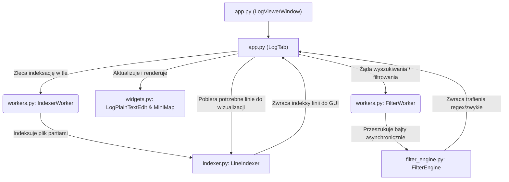

# Architektura Systemu

Poniższy dokument opisuje wysokopoziomową architekturę oraz podział odpowiedzialności wewnątrz głównego pakietu `log_reader/`. Aplikacja `Log Viewer` zrealizowana jest zgodnie z podejściem jednokierunkowego przepływu danych pomiędzy modułami, tak aby praca nad bardzo dużymi plikami (kilkudziesięciu gigabajtów) mogła odbywać się bez zapychania zasobów.

## Wysokopoziomowy Przepływ Danych

Poniższy diagram ilustruje, w jaki sposób komponenty wewnątrz pakietu współdziałają ze sobą podczas procesu otwierania, indeksowania, i wyświetlania dużego pliku.

## Podział na Moduły i Ich Odpowiedzialność

### 1. `app.py`
Pełni rolę kontrolera i punktu wejścia dla logiki biznesowej okna aplikacji. Zawiera dwie główne klasy:
* `LogViewerWindow`: Główne okno (dziedziczy z `QMainWindow`), które zawiaduje globalnymi konfiguracjami, wsparciem dla Drag & Drop oraz globalnymi skrótami klawiszowymi. Reaguje jako menedżer kart (tabs).
* `LogTab`: Widżet jednej otwartej zakładki dla pojedynczego pliku. Klasa spina komponenty z widoku, workerów pracujących w tle oraz silnik filtrów. Odpowiada również za utrzymanie wirtualnego ekranu (ładowanie widocznych bloków tekstu).

### 2. `indexer.py`
Stanowi jądro mechanizmu pozwalającego obsłużyć ogromne pliki. Moduł wykorzystuje paczkę `multiprocessing` oraz metody indeksowania w celu minimalizowania obciążenia pamięci.
* Zawiera moduł `LineIndexer`, który z wykorzystaniem asynchronicznych workerów analizuje plik w dużych częściach (np. po 256MB), ustalając relacje liczby linii w stosunku do przesunięć bajtów w pliku (`IndexEntry`). Indeks jest potem używany w aplikacji do szybkiego poruszania się po wielogigabajtowym pliku.

### 3. `filter_engine.py`
Niskopoziomowy silnik wyszukiwania i filtrowania danych realizowany w osobnym wątku.
* Klasa `FilterEngine` przetwarza surowe bajty zamiast bezpośrednio wczytywać napisy typu String (jeśli nie zażądano wyrażeń regularnych w danym requeście). Skutkuje to ogromnym wzrostem wydajności dla wyszukiwania i odfiltrowania danych dla określonych "igieł". Moduł jest zabezpieczony przed sytuacjami typu *race conditions* dla przerywanych akcji poszukiwawczych.

### 4. `workers.py`
Katalog obiektów wspierających asynchroniczność w Qt przy użyciu technologii `QThread` i `QObject`.
Zawiera workery, których cel polega na odseparowaniu ciężkich operacji Wejścia/Wyjścia (I/O) z głównego pętli UI:
* `IndexerWorker` – emituje zdarzenia w miarę postępu tworzenia mapowania offsetów indeksu z `LineIndexer`.
* `FilterWorker` – spina działania `FilterEngine` wywołując asynchroniczne postępy wyszukiwania.
* `SaveWorker` – obsługuje tło zapisu zawartości po wniesieniu edycji na poszczególnych linijkach.

### 5. `widgets.py`
Definiuje wyspecjalizowane, wizualne komponenty widoku dla biblioteki PySide6:
* `LogPlainTextEdit` – autorski widżet poszerzający bazowy `QPlainTextEdit` o wsparcie do pracy ze zdarzeniami `Drag & Drop`, numeracją wierszy oraz malowaniem kontekstowego podświetlenia dla bieżącej linii.
* `MiniMap` – maluje na kanwie pionową mapę w oparciu o wykryte alerty typu *ERROR*, *WARN*, *INFO* czy *DEBUG*, oferując błyskawiczną nawigację.
* `SearchResultsModel` – model danych oparty na `QAbstractListModel`, optymalizujący listę setek tysięcy rezultatów bez obciążania i zawieszania aplikacji za pomocą leniwego pobierania elementów w miarę scrollowania (`fetchMore()`).
