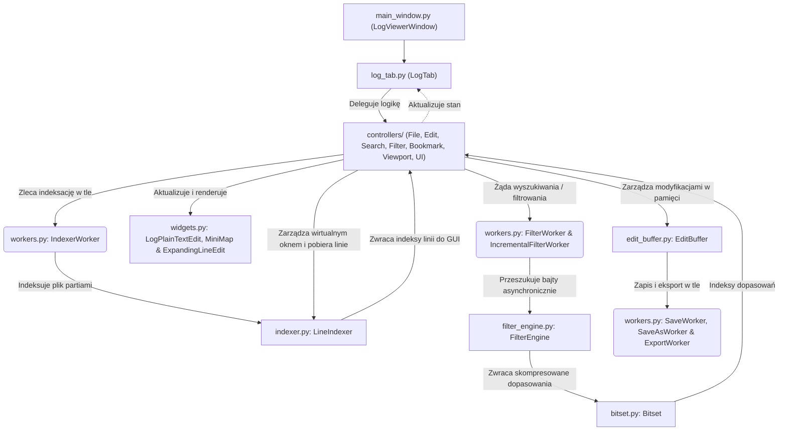

# Architektura Systemu

Poniższy dokument opisuje wysokopoziomową architekturę oraz podział odpowiedzialności wewnątrz głównego pakietu `log_viewer/`. Aplikacja `Log Viewer` zrealizowana jest zgodnie z podejściem jednokierunkowego przepływu danych pomiędzy modułami, tak aby praca nad bardzo dużymi plikami (kilkudziesięciu gigabajtów) mogła odbywać się bez zapychania zasobów.

## Wysokopoziomowy Przepływ Danych

Poniższy diagram ilustruje, w jaki sposób komponenty wewnątrz pakietu współdziałają ze sobą podczas procesu otwierania, indeksowania, filtrowania, edycji i wyświetlania dużego pliku.

```mermaid
flowchart TD
    A["main_window.py (LogViewerWindow)"] --> B["log_tab.py (LogTab)"]
    B -->|"Deleguje logikę"| Z["controllers/ (File, Edit, Search, Filter, Bookmark, Viewport, UI)"]
    Z -->|"Zleca indeksację w tle"| C("workers.py: IndexerWorker")
    C -->|"Indeksuje plik partiami"| D["indexer.py: LineIndexer"]
    D -->|"Zwraca indeksy linii do GUI"| Z
    Z -->|"Zarządza wirtualnym oknem i pobiera linie"| D
    Z -->|"Aktualizuje i renderuje"| E["widgets.py: LogPlainTextEdit, MiniMap & ExpandingLineEdit"]
    Z -->|"Żąda wyszukiwania / filtrowania"| F("workers.py: FilterWorker & IncrementalFilterWorker")
    F -->|"Przeszukuje bajty asynchronicznie"| G["filter_engine.py: FilterEngine"]
    G -->|"Zwraca skompresowane dopasowania"| H["bitset.py: Bitset"]
    H -->|"Indeksy dopasowań"| Z
    Z -->|"Zarządza modyfikacjami w pamięci"| EB["edit_buffer.py: EditBuffer"]
    EB -->|"Zapis i eksport w tle"| W2("workers.py: SaveWorker, SaveAsWorker & ExportWorker")
    Z -.->|"Aktualizuje stan"| B
```

## Podział na Moduły i Ich Odpowiedzialność

### 1. `main_window.py`
Pełni rolę kontrolera głównego okna aplikacji. Zawiera klasę `LogViewerWindow` (dziedziczącą z `QMainWindow`), która zawiaduje globalnymi konfiguracjami, wsparciem dla Drag & Drop, globalnymi skrótami klawiszowymi oraz zarządza menedżerem kart (`QTabWidget`).

### 2. `log_tab.py` i podpakiet `controllers/`
Zawiera klasę `LogTab`, czyli widżet odpowiadający za pojedynczą otwartą zakładkę pliku. Komponent ten wykorzystuje architekturę kompozycji, oddelegowując swoje odpowiedzialności domenowe do wyspecjalizowanych kontrolerów znajdujących się w katalogu `log_viewer/controllers/`:
* `FileController` – zarządza wczytywaniem, indeksowaniem, przeładowywaniem plików oraz śledzeniem zmian w trybie na żywo (*Tail / Follow Mode*).
* `EditController` – nadzoruje edycję tekstu wewnątrz wirtualnego widoku, operacje dialogowe zapisu oraz eksport zmian.
* `SearchController` – koordynuje proces wyszukiwania fraz i wyrażeń w pliku oraz w przefiltrowanych wynikach.
* `FilterController` – steruje filtrowaniem zawartości z uwzględnieniem dodatkowych opcji (jak linie kontekstu, negacja, wyrażenia regularne).
* `BookmarkController` – zarządza zakładkami (*bookmarks*) w obrębie otwartego pliku oraz ich usuwaniem i nawigacją.
* `ViewportController` – zarządza wirtualnym oknem (*viewport*), leniwym doładowywaniem wierszy z krawędzi (`append_lines`, `prepend_lines`), nawigacją (`cmd_goto`, skok do linii i do offsetu bajtowego) oraz zaznaczeniami podświetleń (`ExtraSelections`).
* `UIController` – zarządza elementami interfejsu karty, połączeniami sygnałów i slotów (drzewa zakładek i edycji, widok wyników wyszukiwania `search_results_view`), dynamiczną aplikacją motywów (Dark/Light), czcionek oraz synchronizacją wskaźnika minimapy.

Klasa główna `LogTab` spina ze sobą te kontrolery, zachowując zwięzłość kodu i spójność stanu w karcie.

### 3. `indexer.py`
Stanowi jądro mechanizmu pozwalającego obsłużyć ogromne pliki. Moduł wykorzystuje paczkę `multiprocessing` oraz metody rzadkiego indeksowania w celu minimalizowania obciążenia pamięci.
* Zawiera klasę `LineIndexer`, która analizuje plik w dużych częściach (np. zoptymalizowanymi chunkami 32 MB), ustalając relacje liczby linii w stosunku do przesunięć bajtów w pliku (`IndexEntry`). Dla dużych plików indeksowanie wykonuje się wielowątkowo przy użyciu pamięci współdzielonej (`multiprocessing.sharedctypes`), a odczyty z indeksu są optymalizowane przez sekwencyjne proxy dla modułu `bisect`.

### 4. `filter_engine.py`
Niskopoziomowy silnik wyszukiwania i filtrowania danych realizowany w osobnym wątku.
* Klasa `FilterEngine` przetwarza surowe bajty zamiast bezpośrednio wczytywać napisy typu String (strategie `PlainTextStrategy` i `RegexStrategy`). Skutkuje to ogromnym wzrostem wydajności dla wyszukiwania i odfiltrowania danych dla określonych wzorców. Silnik zwraca wysoce skompresowany obiekt `Bitset` zamiast standardowych list, redukując użycie pamięci i przyspieszając operacje binarne na milionach dopasowań.

### 5. `bitset.py`
Samodzielny fundament wydajnościowy aplikacji, operujący bezpośrednio na tablicach słów maszynowych `array.array('Q')`:
* Przechowuje miliony trafień w skompresowanej strukturze bitowej, redukując zużycie pamięci operacyjnej do ułamka megabajta.
* Oferuje zoptymalizowane zliczanie unikalnych dopasowań w C (`itertools.accumulate` oraz `int.bit_count`) i leniwe buforowanie długości.
* Zawiera autorskie, szybkie implementacje wyszukiwania binarnego (`bisect_left_custom`, `bisect_right_custom`) operujące bezpośrednio na bitach bez konieczności rozpakowywania ich do list Pythona.

### 6. `edit_buffer.py`
Zarządza stanem modyfikacji tekstu bez naruszania oryginalnego pliku źródłowego:
* Klasa `EditBuffer` mapuje zmodyfikowane numery linii na ich nową treść (`line_no -> new_text`).
* Realizuje bezpieczny, atomowy zapis do pliku z użyciem pliku tymczasowego (`.log-viewer_tmp_*`) oraz kopii zapasowej (`.bak`).
* Weryfikuje nienaruszalność pliku przed zapisem w nanosekundach (`st_mtime_ns`) oraz rozmiarze (`st_size`), zabezpieczając przed błędami wyścigu (TOCTOU).

### 7. `formatters.py`
Moduł odpowiedzialny za automatyczne wykrywanie i estetyczne formatowanie (*pretty-print*) uporządkowanych struktur danych:
* `format_json` – wyodrębnia i formatuje struktury JSON osadzone wewnątrz linii tekstu.
* `format_xml` – bezpiecznie wyodrębnia i formatuje bloki XML przy użyciu biblioteki `defusedxml` (zabezpieczenie przed atakami typu XML Entity Expansion).
* Wykorzystywany m.in. przez okno dialogowe `FormatDialog` do analizy trudnych do odczytania rekordów logów.

### 8. `workers.py`
Katalog obiektów wspierających asynchroniczność w Qt przy użyciu technologii `QThread` i `QObject`.
Zawiera workery, których cel polega na odseparowaniu ciężkich operacji Wejścia/Wyjścia (I/O) z głównej pętli UI:
* `IndexerWorker` – emituje zdarzenia w miarę postępu tworzenia mapowania offsetów indeksu z `LineIndexer`.
* `FilterWorker` – spina działania `FilterEngine` wywołując asynchroniczne postępy wyszukiwania oraz agreguje finalny obiekt `Bitset` dla modelu.
* `IncrementalFilterWorker` – wyspecjalizowany wątek powiązany z trybem "Follow/Tail Mode", skanujący na bieżąco (inkrementalnie) i zwracający trafienia z nowo dodanych części logu.
* `SaveWorker` – obsługuje tło zapisu zawartości po wniesieniu edycji na poszczególnych linijkach.
* `SaveAsWorker` – obsługuje zapis zmodyfikowanej zawartości do nowego pliku asynchronicznie.
* `ExportWorker` – obsługuje eksport wyników filtrowania i zaznaczeń do osobnego pliku.

### 9. `widgets.py`
Definiuje wyspecjalizowane, wizualne komponenty widoku dla biblioteki PySide6:
* `LogPlainTextEdit` – autorski widżet poszerzający bazowy `QPlainTextEdit` o wsparcie do pracy ze zdarzeniami `Drag & Drop`, numeracją wierszy oraz malowaniem kontekstowego podświetlenia dla bieżącej linii.
* `MiniMap` – maluje na kanwie pionową mapę wskaźnika pozycji i widocznego obszaru w oparciu o całkowitą liczbę wierszy, oferując błyskawiczną nawigację.
* `SearchResultsModel` – model danych oparty na `QAbstractListModel`, optymalizujący listę setek tysięcy rezultatów bez obciążania i zawieszania aplikacji za pomocą leniwego pobierania elementów w miarę scrollowania (`fetchMore()`). Jako źródło prawdy przyjmuje strukturę `Bitset`.
* `ExpandingLineEdit` – zaawansowane pole wyszukiwania z pływającą nakładką wielowierszową (*floating overlay*), automatycznym rozszerzaniem widoku dla długich zapytań, historią wyrażeń i wsparciem skrótów klawiszowych, działające bez deformowania layoutu kontrolek rodzica.
* Oraz dodatkowe komponenty (takie jak `LineNumberArea`, `SettingsDialog`, `FormatDialog`), które odpowiadają za detale wizualne i okna dialogowe aplikacji.

### 10. Moduły wspierające: `config.py`, `i18n.py`, `helpers.py`
* `config.py` – zarządza trwałą konfiguracją użytkownika (`UserConfig`) zapisaną w pliku JSON w katalogu domowym (`~/.log-viewer.json`).
* `i18n.py` – centralne repozytorium tłumaczeń interfejsu aplikacji, wspierające przełączanie w locie pomiędzy językiem polskim i angielskim.
* `helpers.py` – zawiera stałe systemowe, definicje palet stylów motywów (`THEME_DARK`, `THEME_LIGHT`), obsługę przezroczystego odczytu plików skompresowanych (`open_maybe_compressed` dla `.gz`, `.bz2`, `.xz`), skracanie zbyt długich linii (`truncate_for_display`) oraz parser zdarzeń przeciągania plików (Drag & Drop).
