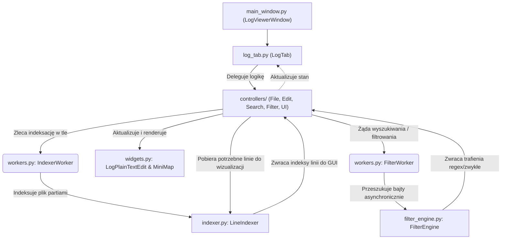

# Architektura Systemu

Poniższy dokument opisuje wysokopoziomową architekturę oraz podział odpowiedzialności wewnątrz głównego pakietu `log_viewer/`. Aplikacja `Log Viewer` zrealizowana jest zgodnie z podejściem jednokierunkowego przepływu danych pomiędzy modułami, tak aby praca nad bardzo dużymi plikami (kilkudziesięciu gigabajtów) mogła odbywać się bez zapychania zasobów.

## Wysokopoziomowy Przepływ Danych

Poniższy diagram ilustruje, w jaki sposób komponenty wewnątrz pakietu współdziałają ze sobą podczas procesu otwierania, indeksowania, i wyświetlania dużego pliku.

```mermaid
flowchart TD
    A["main_window.py (LogViewerWindow)"] --> B["log_tab.py (LogTab)"]
    B -->|"Deleguje logikę"| Z["controllers/ (File, Edit, Search, Filter, UI)"]
    Z -->|"Zleca indeksację w tle"| C("workers.py: IndexerWorker")
    C -->|"Indeksuje plik partiami"| D["indexer.py: LineIndexer"]
    D -->|"Zwraca indeksy linii do GUI"| Z
    Z -->|"Pobiera potrzebne linie do wizualizacji"| D
    Z -->|"Aktualizuje i renderuje"| E["widgets.py: LogPlainTextEdit & MiniMap"]
    Z -->|"Żąda wyszukiwania / filtrowania"| F("workers.py: FilterWorker")
    F -->|"Przeszukuje bajty asynchronicznie"| G["filter_engine.py: FilterEngine"]
    G -->|"Zwraca trafienia regex/zwykłe"| Z
    Z -.->|"Aktualizuje stan"| B

```

## Podział na Moduły i Ich Odpowiedzialność

### 1. `main_window.py`
Pełni rolę kontrolera głównego okna aplikacji. Zawiera klasę `LogViewerWindow` (dziedziczącą z `QMainWindow`), która zawiaduje globalnymi konfiguracjami, wsparciem dla Drag & Drop, globalnymi skrótami klawiszowymi oraz zarządza menedżerem kart (tabs).

### 2. `log_tab.py` i podpakiet `controllers/`
Zawiera klasę `LogTab`, czyli widżet odpowiadający za pojedynczą otwartą zakładkę pliku. Komponent ten wykorzystuje architekturę kompozycji, oddelegowując swoje odpowiedzialności domenowe do wyspecjalizowanych kontrolerów znajdujących się w katalogu `log_viewer/controllers/`:
* `FileController` – zarządza wczytywaniem, indeksowaniem i przeładowywaniem plików.
* `EditController` – nadzoruje edycję tekstu wewnątrz wirtualnego widoku oraz eksport zmian.
* `SearchController` – koordynuje proces wyszukiwania fraz i wyrażeń w pliku.
* `FilterController` – steruje filtrowaniem zawartości z uwzględnieniem dodatkowych opcji (jak linie kontekstu).
* `UIController` – zarządza widokiem, podświetleniami linii i paskami nawigacyjnymi.

Klasa główna `LogTab` spina ze sobą te kontrolery, zachowując zwięzłość kodu i spójność stanu w karcie.

### 3. `app.py`
Plik zredukowany do roli fasady importującej klasy z `main_window.py` oraz `log_tab.py`, zachowując wsteczną kompatybilność importów w innych częściach aplikacji i testach.

### 4. `indexer.py`
Stanowi jądro mechanizmu pozwalającego obsłużyć ogromne pliki. Moduł wykorzystuje paczkę `multiprocessing` oraz metody indeksowania w celu minimalizowania obciążenia pamięci.
* Zawiera moduł `LineIndexer`, który z wykorzystaniem asynchronicznych workerów analizuje plik w dużych częściach (np. po 256MB), ustalając relacje liczby linii w stosunku do przesunięć bajtów w pliku (`IndexEntry`). Indeks jest potem używany w aplikacji do szybkiego poruszania się po wielogigabajtowym pliku.

### 5. `filter_engine.py`
Niskopoziomowy silnik wyszukiwania i filtrowania danych realizowany w osobnym wątku.
* Klasa `FilterEngine` przetwarza surowe bajty zamiast bezpośrednio wczytywać napisy typu String (jeśli nie zażądano wyrażeń regularnych w danym requeście). Skutkuje to ogromnym wzrostem wydajności dla wyszukiwania i odfiltrowania danych dla określonych "igieł". Silnik zwraca wysoce skompresowany obiekt `Bitset` zamiast standardowych list, redukując użycie pamięci i przyspieszając operacje binarne na milionach dopasowań. Moduł jest zabezpieczony przed sytuacjami typu *race conditions* dla przerywanych akcji poszukiwawczych.

### 6. `workers.py`
Katalog obiektów wspierających asynchroniczność w Qt przy użyciu technologii `QThread` i `QObject`.
Zawiera workery, których cel polega na odseparowaniu ciężkich operacji Wejścia/Wyjścia (I/O) z głównego pętli UI:
* `IndexerWorker` – emituje zdarzenia w miarę postępu tworzenia mapowania offsetów indeksu z `LineIndexer`.
* `FilterWorker` – spina działania `FilterEngine` wywołując asynchroniczne postępy wyszukiwania oraz agreguje finalny obiekt `Bitset` dla modelu.
* `SaveWorker` – obsługuje tło zapisu zawartości po wniesieniu edycji na poszczególnych linijkach.

### 7. `widgets.py`
Definiuje wyspecjalizowane, wizualne komponenty widoku dla biblioteki PySide6:
* `LogPlainTextEdit` – autorski widżet poszerzający bazowy `QPlainTextEdit` o wsparcie do pracy ze zdarzeniami `Drag & Drop`, numeracją wierszy oraz malowaniem kontekstowego podświetlenia dla bieżącej linii.
* `MiniMap` – maluje na kanwie pionową mapę wskaźnika pozycji i widocznego obszaru w oparciu o całkowitą liczbę wierszy, oferując błyskawiczną nawigację.
* `SearchResultsModel` – model danych oparty na `QAbstractListModel`, optymalizujący listę setek tysięcy rezultatów bez obciążania i zawieszania aplikacji za pomocą leniwego pobierania elementów w miarę scrollowania (`fetchMore()`). Jako źródło prawdy przyjmuje strukturę `Bitset`.
